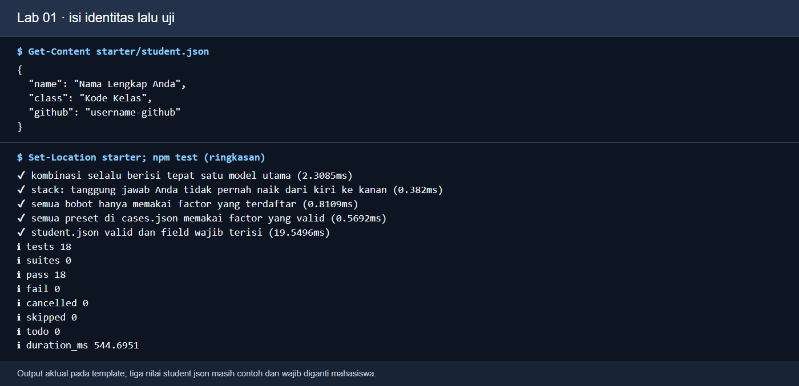
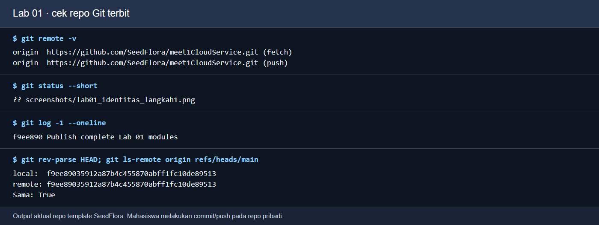
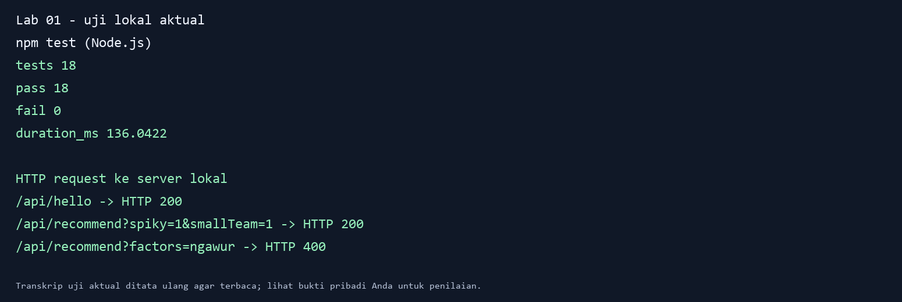
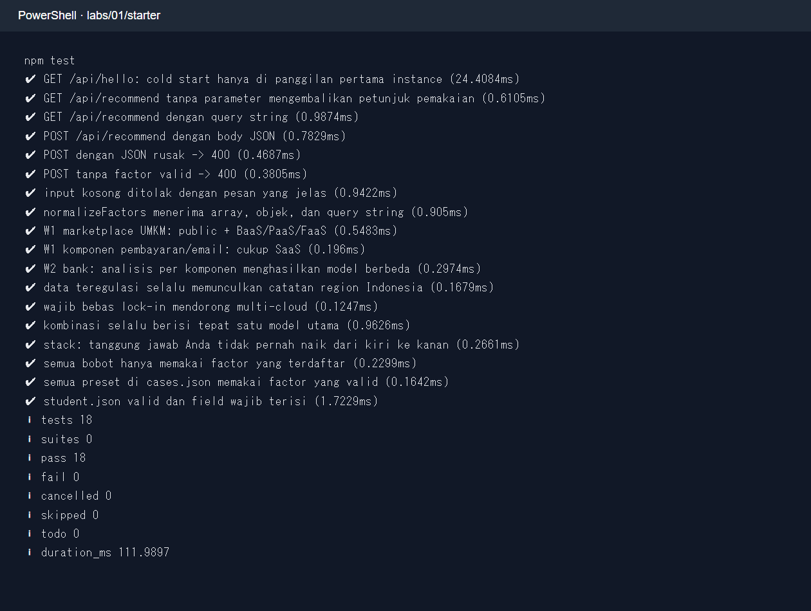
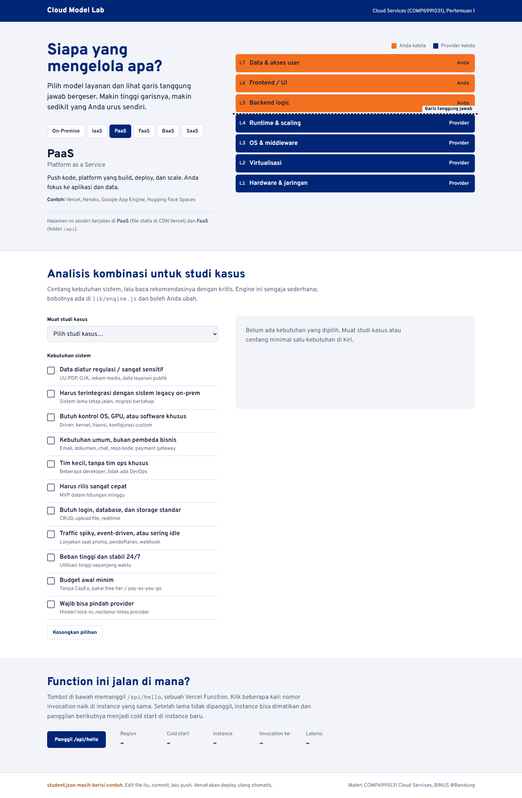
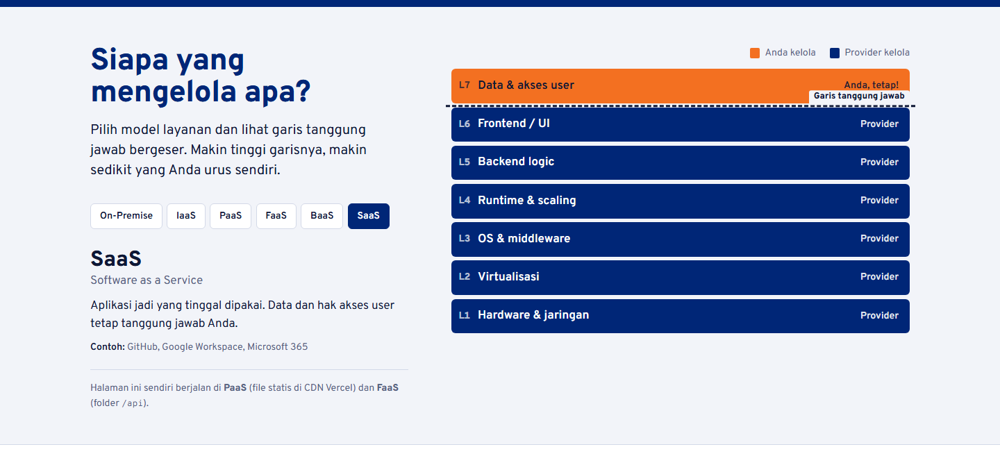
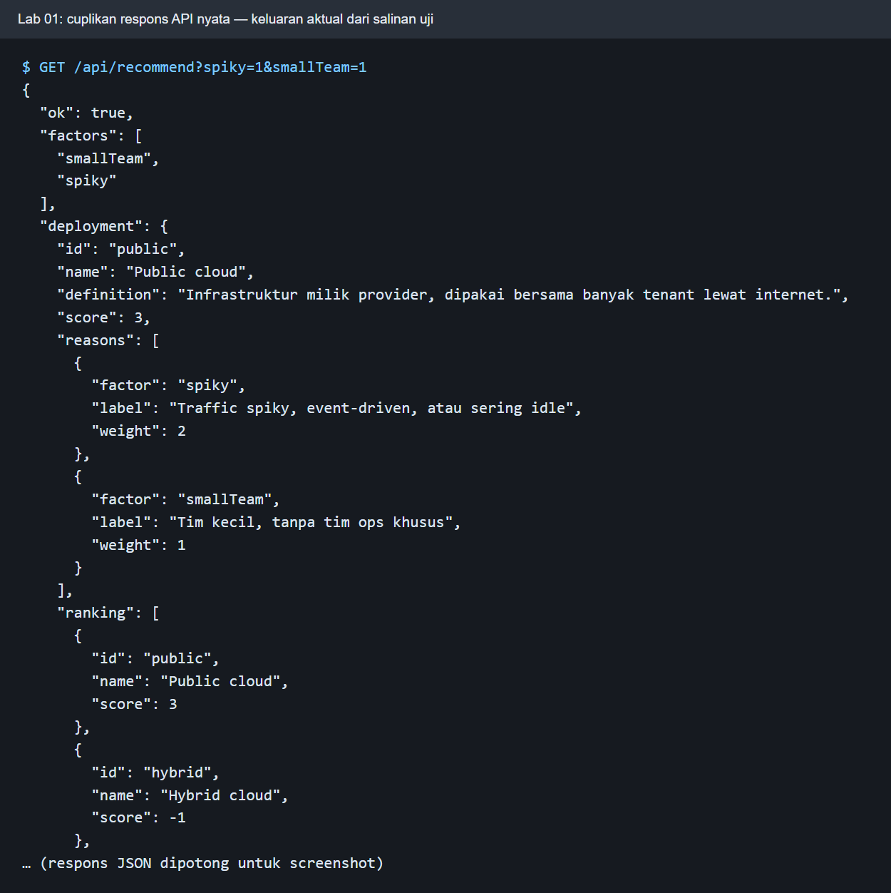
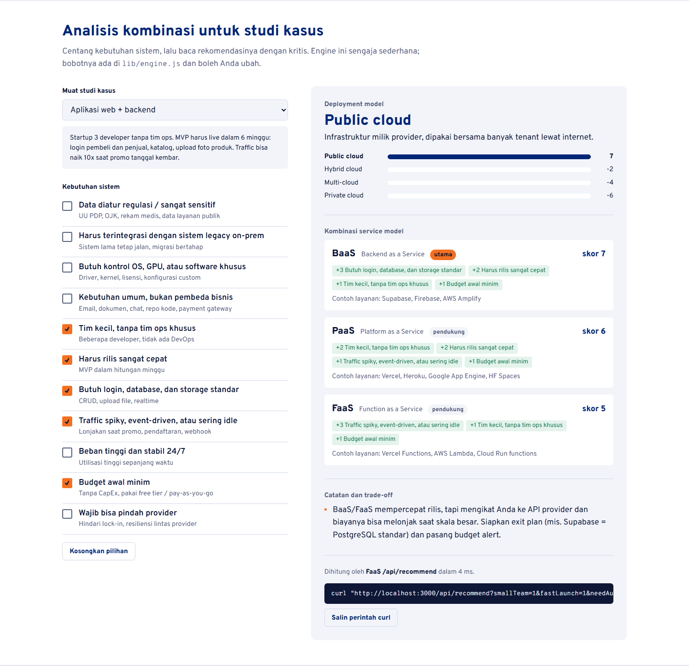

# Panduan dosen Lab 01 — Cloud Model Lab, Git, dan API pertama

**Durasi demo:** 90 menit. **Capaian:** mahasiswa membedakan model layanan dan deployment cloud, menjelaskan tanggung jawab pengguna/penyedia, menjalankan halaman serta dua fungsi API, lalu menulis keputusan arsitektur per komponen. Gunakan [modul mahasiswa](MODUL_MAHASISWA.md) sebagai lembar praktik dan [panduan Git](PANDUAN_GIT.md) untuk pengumpulan. Repo materi mandiri adalah `SeedFlora/meet1CloudService`.

## Sebelum kelas

1. Pastikan Node.js 20+ dan Git tersedia. Dari **root repo Lab 01**, jalankan `cd starter`, `node --version`, `npm test`. Tidak ada dependency eksternal sehingga `npm install` tidak diperlukan. Pada uji ulang lokal 7 Oktober 2026, **18 tes lulus dan 0 gagal**.
2. Cek port 3000 kosong. Mulai server dengan `npm run dev`; buka `http://localhost:3000`. Hentikan dengan Ctrl+C di akhir kelas.
3. Siapkan dua terminal: satu untuk server, satu untuk `curl.exe` di PowerShell atau `curl` di Bash. Jangan proyeksikan token, password, atau data mahasiswa.
4. Jika GitHub/Vercel belum dapat diakses, semua kode, API, dan analisis kasus tetap dapat dikerjakan lokal. Deployment adalah perluasan yang membutuhkan akun dan izin repo.

## Alur 90 menit

| Menit | Aksi dosen | Aksi mahasiswa | Bukti/checkpoint |
|---:|---|---|---|
| 0–10 | Terangkan lima karakteristik NIST dan shared responsibility. | Sebutkan contoh IaaS/PaaS/SaaS/BaaS/FaaS. | Satu contoh layanan dan hal yang tetap dikelola pengguna. |
| 10–20 | Tunjukkan struktur `starter/`, `student.json`, dan `npm test`. | Isi tiga field identitas publik yang sesuai, lalu uji. | `pass 18`, `fail 0`; data contoh sudah diganti. |
| 20–35 | Jalankan `npm run dev`; pilih IaaS, PaaS, SaaS. | Catat lapisan yang pindah pengelolanya. | Tabel tanggung jawab di laporan. |
| 35–50 | Uji GET `/api/hello`, `/api/recommend`, dan faktor tidak dikenal. | Ulangi dengan `curl.exe`/`curl`; baca status HTTP. | 200, 200, 400. |
| 50–70 | Pilih satu kasus A–D dan contohkan analisis per komponen. | Isi worksheet dengan tiga alasan, trade-off, alternatif. | Keputusan yang dapat dijelaskan, bukan hanya output engine. |
| 70–82 | Demonstrasikan issue, commit, diff staged, push. | Simpan `hasil/lab01.md` dan bukti sendiri. | Repo pribadi dan commit; Actions menjalankan 18 tes. |
| 82–90 | Bahas lima pertanyaan, error umum, dan penutup. | Serahkan tautan repo/issue; Vercel bila ditugaskan. | Jawaban singkat dan status tes. |

## Demo terminal dan cara kerjanya

Dari root repo di **PowerShell**:

```powershell
Set-Location .\starter
node --version
npm test
npm run dev
```

`npm test` memakai runner bawaan Node untuk logika engine, endpoint, dan struktur data. `npm run dev` menjalankan server lokal pada 3000. Pada terminal kedua gunakan:

```powershell
curl.exe -i http://localhost:3000/api/hello
curl.exe -i 'http://localhost:3000/api/recommend?spiky=1&smallTeam=1'
curl.exe -i 'http://localhost:3000/api/recommend?factors=ngawur'
```

Status 200 pertama membuktikan fungsi hello menjawab. Status 200 kedua menunjukkan engine menerima faktor `spiky` dan `smallTeam`; baca alasan dan skor sebelum menyimpulkan. Status 400 ketiga menunjukkan validasi input berjalan. Di Bash gunakan `curl` tanpa `.exe`. Jangan menyamakan tes hijau dengan identitas sudah benar: `student.json` contoh masih memenuhi syarat format tes.

## Screenshot untuk ditunjukkan bersama command



**Perintah:** `Get-Content starter/student.json`, `npm test`. **Fungsi:** tunjukkan file yang harus diedit dan validasi awal. **Cara kerja:** Node membaca JSON dan menjalankan 18 pengujian. **Baca:** `pass 18/fail 0` dapat muncul walau nama masih contoh; dosen harus mengecek isi file. Gambar adalah render output command aktual.



*SHA pada gambar adalah snapshot saat uji. Setelah modul diperbarui, jalankan ulang perintah untuk memeriksa commit terbaru.*

**Perintah:** `git remote -v`, `git status --short`, `git log -1`, `git rev-parse HEAD`, `git ls-remote origin refs/heads/main`. **Fungsi:** memeriksa tujuan push dan apakah commit lokal sudah ada di remote. **Cara kerja:** kedua SHA dibandingkan. **Baca:** `Sama: True` untuk repo pengajar; mahasiswa mengulanginya pada repo pribadi setelah commit/push. Gambar adalah render output command aktual, bukan bukti push mahasiswa.



**Perintah:** `npm test` dan tiga GET di atas. **Fungsi:** mengunci baseline kode serta kontrak HTTP. **Cara kerja:** Node menguji fungsi, kemudian server menerima request dan mengembalikan status. **Baca:** 18/18 tes, 200/200/400. Cuplikan terminal adalah keluaran aktual yang ditata agar terbaca.


**Perintah:** `npm run dev`, buka `http://localhost:3000`. **Fungsi:** memperlihatkan model layanan dan faktor kasus. **Cara kerja:** browser mengambil HTML/JS dari server yang sama dengan API. **Baca:** panel model, daftar faktor, serta area rekomendasi; identitas contoh perlu diganti oleh mahasiswa.



**Perintah:** `npm test` di `starter/`. **Fungsi:** menunjukkan bentuk ringkasan runner Node. **Cara kerja:** `node --test` menemukan tiga file tes. **Baca:** `pass 18` dan `fail 0`; gunakan bukti run terbaru di atas untuk kelas ini.



**Perintah:** `npm run dev`, lalu buka URL lokal. **Fungsi:** orientasi UI. **Cara kerja:** JavaScript memuat `student.json`, diagram tanggung jawab, dan kasus. **Baca:** setiap panel sebelum mahasiswa mengubah faktor.



**Perintah:** klik pilihan **SaaS**. **Fungsi:** diskusi batas pengelolaan. **Cara kerja:** UI mengganti garis dan warna tiap lapisan. **Baca:** data dan akses tetap perlu dikelola pengguna, sedangkan operasi software/platform ada pada penyedia.



**Perintah:** GET `/api/recommend?spiky=1&smallTeam=1`. **Fungsi:** hubungkan form browser dengan JSON API. **Cara kerja:** handler memvalidasi faktor lalu memanggil engine skor. **Baca:** status, faktor yang diterima, kombinasi model, alasan, dan trade-off.



**Perintah:** pilih satu preset di UI. **Fungsi:** mulai diskusi keputusan per komponen. **Cara kerja:** preset mencentang faktor yang kemudian dihitung engine. **Baca:** output adalah hipotesis awal; minta mahasiswa menyebut faktor yang belum terwakili.

## Kunci diskusi dan semua kasus

| Kasus | Contoh keputusan | Alasan dan keberatan yang perlu muncul |
|---|---|---|
| A, event kampus | SaaS form jika sederhana; bila perlu kuota/pembayaran, PaaS frontend + BaaS data + FaaS webhook pada public cloud. | Lonjakan singkat, panitia kecil, biaya idle. Uji kuota dan ekspor data; jangan mengumpulkan data yang tidak diperlukan. |
| B, klinik | Pertimbangkan SaaS RME dengan kontrak, lokasi data, audit akses, dan ekspor; integrasi khusus dapat dipisah. | Data sensitif dan dua staf IT membuat operasi private penuh berat. Verifikasi aturan serta kewajiban terbaru sebelum keputusan nyata. |
| C, AI dubbing | Training GPU batch pada IaaS/container; inference pada layanan terpisah; SaaS untuk kebutuhan umum. | GPU periodik, klien global, keinginan pindah penyedia. Spot dapat berhenti; checkpoint model dan biaya transfer perlu diuji. |
| D, PPDB | Integrasi data internal dekat sistem pemda; frontend/antrean elastis pada layanan yang memenuhi ketentuan. | Trafik musiman, data warga, koneksi ke sistem lama. Uji beban, backup/restore, serta aturan lokasi/akses yang berlaku. |

**Lima jawaban inti:** (1) pada PaaS/FaaS tim tetap memegang kode/fungsi, data, konfigurasi dan akses; (2) public cloud adalah model deployment, multi-cloud adalah arsitektur lintas penyedia untuk workload; (3) `spiky` dan `smallTeam` memberi alasan kapasitas elastis dan sedikit operasi, tetapi aturan lokasi/biaya dapat mengubah pilihan; (4) HTTP 400 berasal dari validasi faktor yang tidak dikenal; (5) visibilitas repo Git dan situs deploy adalah pengaturan berbeda. Minta satu alternatif yang ditolak pada setiap worksheet. Rubrik di `starter/exercises/rubric.md` menilai alasan dan trade-off, bukan mencocokkan model engine secara buta.

## Git, penilaian, dan troubleshooting

Dari root repo, salin `hasil/TEMPLATE_LAPORAN.md` menjadi `hasil/lab01.md`. Jalankan `git status --short`, `git add starter hasil/lab01.md hasil/bukti`, `git diff --cached --name-only`, `git diff --cached --check`, baru `git commit` dan `git push`. Workflow root `.github/workflows/verify.yml` menjalankan `npm test` pada push. Untuk Vercel opsional, impor repo pribadi dan set **Root Directory `starter`**, lalu cek halaman dan dua endpoint HTTPS. Jangan tampilkan token pada proyektor.

| Gejala | Diagnosis/aksi |
|---|---|
| `npm` tidak ditemukan | Periksa instalasi Node dan terminal yang digunakan. |
| Port 3000 terpakai | Hentikan server lama; jangan ubah port tanpa menyesuaikan URL bukti. |
| 404 endpoint | Jalankan server dari `starter/`, bukan root repo. |
| 18 tes lulus tetapi nama contoh tampil | Isi `starter/student.json` dan refresh browser; tes hanya memeriksa struktur. |
| Vercel halaman ada tetapi API gagal | Periksa Root Directory `starter`, log deployment, dan commit yang terdeploy. |

**Batas uji yang dilakukan:** kode Node, halaman browser lokal, dan status API 200/200/400 diuji ulang pada komputer ini. Push repo dan deployment Vercel ditangani saat publikasi/kelas dan perlu akun masing-masing.
